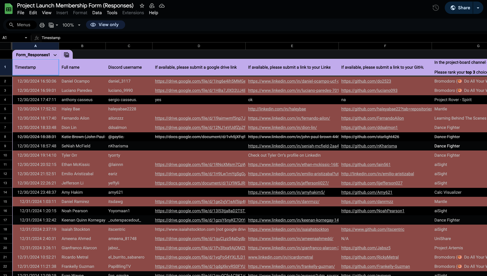
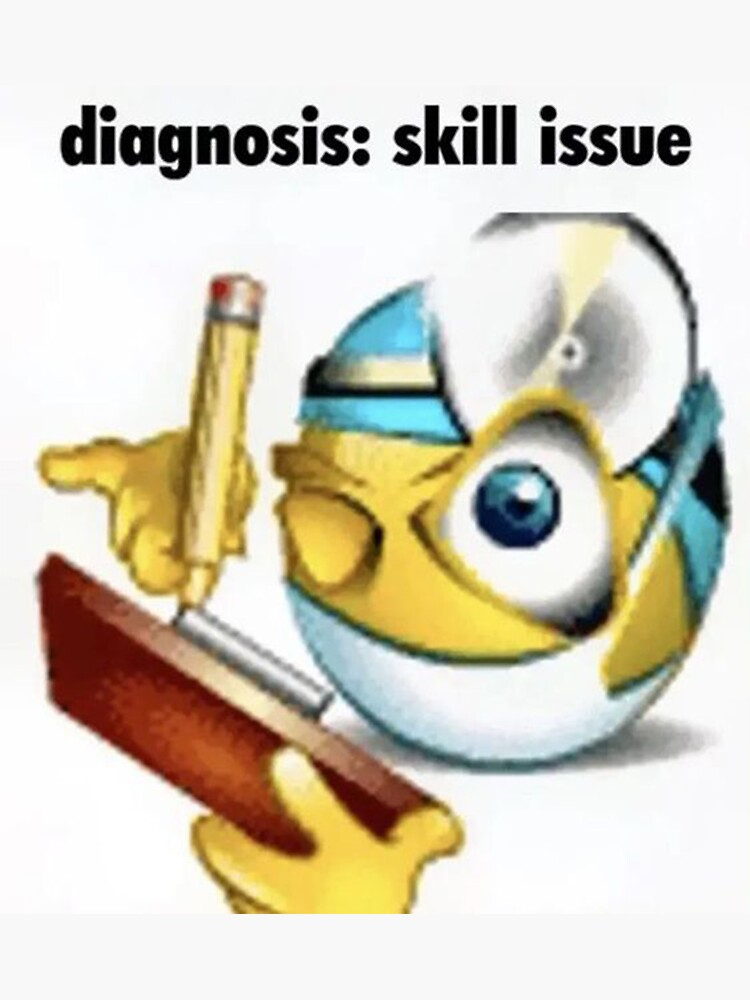

# Intro

This is what recruiters see when you click apply

- ATS systems might make it easier, more engaging, but regardless
- It's a slog; they're human
- **No matter how hard they try it's phisically impossible to fully read into everyone**

And it's not a lie; it's hard out here! 🚨

Because of:
- Overhiring during COVID
- Economic uncertainties
- Uncertanities around AI
- **More competition**

...It's definitely not easy to stand out

*So what do you do?*

## 1. Know That You Suck 

It's important to realize something: *you suck.*

- Yes, there's lots of talented devs at KnightHacks
- You might get the impression everyone's really good... *They're not*
- But unless you've delved into massive production codebases, made some mistakes, crashed, learned, and moved on...

*You suck.*

Compared to an engineer with 10 years of experience or even just a couple, even the best intern *still* sucks!

So those 500x applicants? Most if not *all of them* suck too.

*So what do you do?*

## 2. Also Know You Won't Suck Forever!

Rome wasn't built in a day. Your journey to not sucking will take a while (and it will suck almost as bad as you do), but if you wanna make it less painful...

### 💡 Learn How to Learn

- In your early career, it's not about how good a *programmer* you are, but how good a *learner.*
- **Fun fact:** Junior devs are, for most companies, a strategic loss. They really, *really* suck at the beginning, but as they grow, their value goes up. By the time they become mid-senior level, they'll become a massive asset to their employers! 

**Enthusiastic, skilled learners are the ones who thrive**!

*How do you show you are one?*

#### 🛠️ Build, build, build... 
    - Use new languages, frameworks, tech stacks...
    - Think of projects that are out of your depth and try to make them
    - Build stuff you enjoy! If you like music, make something with that. *You do your best work when you love what you do.*
 
> **Tip:** Pick a level of abstraction you're comfy with, then work from a level below. If you're comfy with a high-level language like Python, perhaps try working with a less abstract one like C#.

#### 📸 Document everything!
- Once you've built something cool (or tried to), reflect about it.
- Write a LinkedIn post, blog post on your website, etc.
- *Show what you learned, even if what you built sucks; that's the most important part of what you built.*
- Make it you! This is also a way to show how you think and carry yourself. Give it some pizzazz! :)

#### 🧠 Learn fast, learn slow... 
- You actually have 2 minds
- One approximates and moves *fast*
- The other processes thoroughly and moves *slow*
- **Get good at learning when to use each!**
    - If you're learning a package manager, boilerplate, syntax... move *fast*...
    - ...But when you get to the nitty-gritty and learn how to build the actual thing, how the language works, what memory looks like, move *slow*.
    - This is a very case-by-case thing; it takes practice to know when to do what!

#### 🦾 Use AI wisely! 
- For us in early career, it shouldn't be more than a fancy lookup tool
- It's a bit like driving
    - You need to understand the road and drive slow... 
    - ...Before you know when it's prudent to break them a bit and go fast!
- Only when you have a firm grasp on what it's writing and can critically assess it, should you let it get its hands on your code.

### 🍩 Don't Oversell Yourself...

Remember, *you suck*.

- If you try to make it look like you know more than you do, you're lying to yourself, and you will definitely look a bit ridiculous.
- If your employer ends up hiring you, god knows what horrors you'll unleash on prod...

So know your place!

*Just because you used C++ twice doesn't mean you should list it as a skill.*

- Focus your resume on what you *really know*. 
We're all noobs; the list will probably not be too long.
- That's OK. Internship/entry level recruiters expect that. Honesty is the best policy! 
- Being realistic makes you look more trustworthy and makes your skillset look more believable.

And for the little that you have, BACK IT UP!

- If you list a language, showcase projects you built with it somewhere
- If you list that project, show images, videos, GitHub links... *proofs of work.*
- Make yourself trustworthy!

*You are but words until you prove otherwise.*

### 🌈 ...But Do BE Yourself! 

- There are a lot of applicants
- If everyone limits themselves to a resume and a generic-looking LinkedIn profile, they're probably not going to get very far

*So what do you do?*

#### 🎭 Build a Personal Brand!

Show others what you're about loudly and proudly
- Make a sick website
- Write some thoughtful blog posts
- Give yourself a logo, a colorscheme, a font, a set visual style...
- Make yourself *memorable*

#### 😺 Do What You Know

If you're applying to be a frontend engineer, everyone probably knows JavaScript.

But if you're a graphic designer, a visual artist, an animator... You'll probably do a better job than the guy who only knows JavaScript

**Leverage the things that make you *you*!**

- Your skills and passions might feel very different from software, but there's *always* creative ways to combine them.
- Absolutely *everyone* is different; why focus on showcasing the parts of you that aren't?
- If you were a recruiter at Spotify and had 2 engineers who knew TypeScript, would you hire the one that doesn't care about music over the other one who can't shut up about it? 

## 3. Enjoy The Journey ⛵

At 19, 20, 21 it's ridiculous to expect to know what to do with your life

That's your greatest battle, your biggest problem

But we're computer scientists... When we have huge problems, we break them down into smaller ones.

Instead of thinking long-term, try bite-sized pieces!

### 🌟 Find Your North Star

*Set a concrete, measurable goal with a deadline. Will you...*

- Land an internship?
- Build a cool project?
- Win a hackathon?
- Become an officer at a club?
- Learn Rust?

As you work towards these short-term goals, you learn more about yourself and what you do.

As you learn more about yourself, you will also learn more about where you want to go.

*The closer you get to the end of the tunnel, the brighter the light becomes... You just have to keep going*.

### 📆 Show Up Every Day, Even The Bad Ones

The journey's shitty

Embarrassing

Hard

Discouraging

Annoying

Some days you'll make a lot of progress

Some other days you'll barely move 1% further...

But think of it this way:

If you get 1% better every single day, you'll be nearly 20x times better in 6 months, and **37x better** in a year!

Show up. Show up every day. Keep showing up. You might surprise yourself with how much sooner your goals happen than you might've expected them to.

---

Thank you! <3
